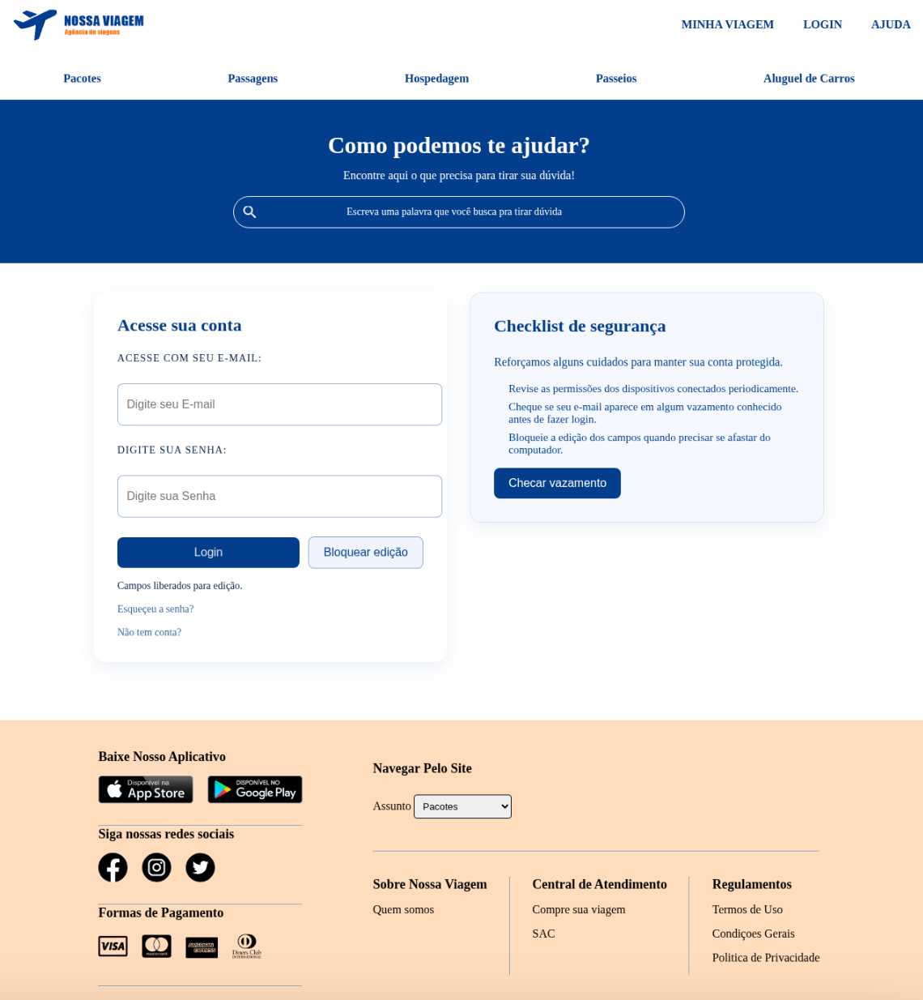
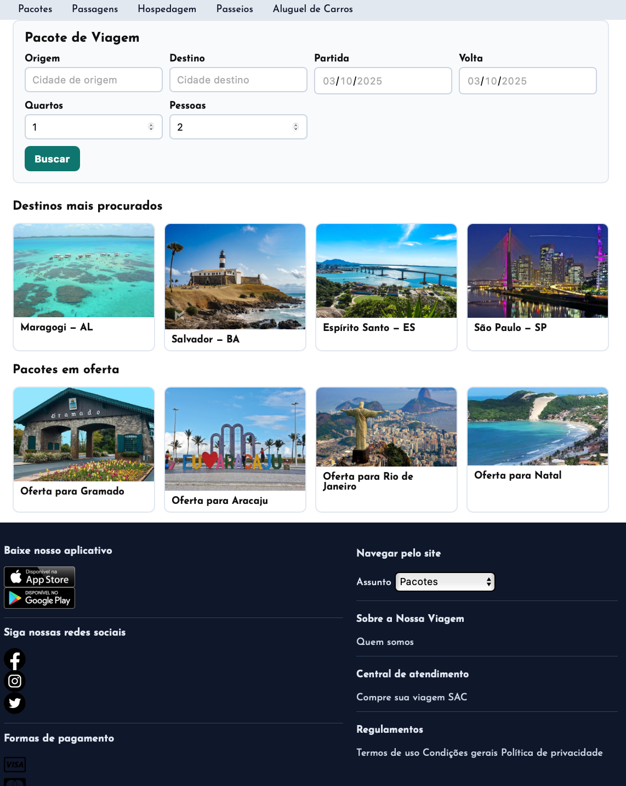

# 🌐 CoderHouse – Desenvolvimento Web

Projeto desenvolvido em grupo durante o curso de **Desenvolvimento Web da CoderHouse**, aplicando fundamentos de **HTML e CSS** com foco em boas práticas de front-end.  

O desafio consistiu em criar um site colaborativamente, passando por todas as etapas do processo: desde a concepção da ideia e elaboração dos esboços iniciais até a implementação da interface e a finalização do código.  

Minha carreira é voltada para **Segurança da Informação**, atuando como especialista em **Pentest, Red Team e Resposta a Incidentes**. Neste trabalho, no entanto, busquei expandir minha visão ao participar do desenvolvimento desde o início, vivenciando o processo criativo e a colaboração entre desenvolvedores.  

A experiência foi extremamente enriquecedora, permitindo exercitar trabalho em equipe, compartilhar conhecimentos e compreender de forma prática o ciclo completo de desenvolvimento de uma aplicação.  

---

## 📸 Prévia do Projeto

  

> 💡 Adicionei também uma versão revisada do mesmo site utilizando **IA**, como forma de comparação e estudo sobre a evolução no processo de desenvolvimento.  
> O código original foi feito há 3 anos, sem apoio de inteligência artificial, e a atualização mostrará como ferramentas modernas podem acelerar e refinar o resultado.  

## 📸 Prévia do Projeto revisado por IA

  
---

## 🚀 Tecnologias

- HTML5  
- CSS3  
- Git / GitHub  

---

## 📂 Estrutura

- `nossa-viagem/` → páginas principais e estilos do site  
- `assets/` → imagens, ícones e arquivos estáticos  

---

## 🎯 Objetivo

- Praticar marcação semântica  
- Aplicar estilização responsiva  
- Exercitar colaboração com Git  

---

## 📊 Comparativo – Versão Original x Versão com IA

Este projeto foi desenvolvido originalmente há cerca de **3 anos**, sem o uso de ferramentas de inteligência artificial.  
Agora, foi criada também uma **versão revisada com apoio de IA**, permitindo comparar como a tecnologia pode acelerar processos, sugerir melhorias de acessibilidade, semântica e boas práticas de front-end.

| Aspecto | Versão Original (2019/2020) | Versão Revisada com IA (2025) |
|---------|------------------------------|--------------------------------|
| **Tecnologias** | HTML + CSS básicos | HTML5 + CSS3 revisados com foco em acessibilidade |
| **Semântica** | Uso limitado de tags semânticas | Estrutura clara com `<main>`, `<section>`, `<figure>` etc. |
| **Formulários** | Inputs sem labels associados e sem validação | Labels com `for/id`, validações (`required`, `min`), `autocomplete` |
| **Acessibilidade** | Foco limitado | Melhorias como `aria-label`, skip-link, foco visível, contrastes |
| **Imagens** | Sem `alt` consistente e otimização | `alt` descritivo, `loading="lazy"`, padronização |
| **SEO** | Title genérico | Title descritivo + meta description |
| **Manutenção** | Estrutura menos modular | Código mais organizado, pronto para evoluir |
| **Ferramentas** | Feito totalmente manual | Revisado com apoio de ChatGPT para sugestões e refino |

> 💡 A proposta é manter ambas as versões no repositório:  
> - A **original**, como registro histórico do aprendizado inicial;  
> - A **atualizada com IA**, como referência de evolução e modernização do mesmo projeto.  

---

## 📦 Como usar

```bash
git clone https://github.com/SunSh1x03/CoderHouse-DevWeb.git
cd CoderHouse-DevWeb/nossa-viagem
# abrir index.html no navegador
